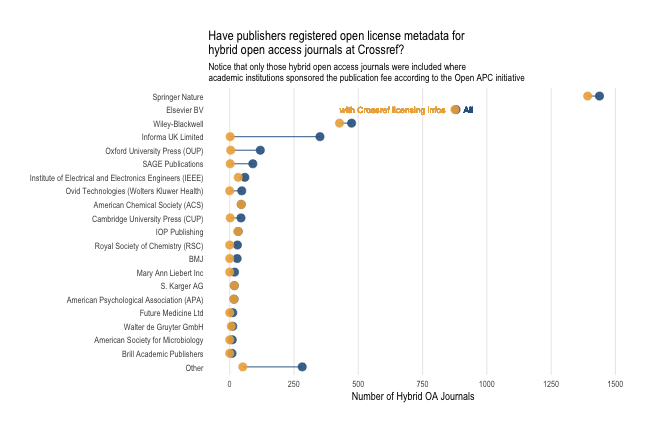

# A dashboard for monitoring hybrid open acccess uptake with R

## About 

This open source dashboard presents the uptake of hybrid open access for 2,905 journals published by 30 publishers between  2013 - 2017. It brings together openly available datasets about hybrid open access into one easy-to-use tool. The following sources are used:

- Crowd-sourced cost information from the [Open APC initiative](https://github.com/openapc/openapc-de) for gathering subscription journals where open access publications were sponsored by research institutions. This includes the [hybrid OA subset](https://github.com/OpenAPC/openapc-de/blob/master/data/apc_de.csv) and the [offsetting dataset](https://github.com/OpenAPC/openapc-de/tree/master/data/offsetting).
- Journal and licensing metadata from [Crossref](https://www.crossref.org/), a DOI minting agency for scholarly literature.
- [Directory of Open Access Journals (DOAJ)](https://doaj.org/) for identifying journals that were flipped from hybrid to full open access between 2013 - 2017.

## Usage

Choose a publisher or journal via the select boxes in the left sidebar. Publisher names are decreasingly sorted according to the number of hybrid open access articles published. Corresponding journals are filtered conditionally to the publisher selection and are sorted alphabetically. 

Information is presented using dynamic graphs. The first tab of the upper graph shows the relational uptake of hybrid open access, the second tab the absolute number of published hybrid open access articles. Bar charts are sub-grouped according to the licensing links found via Crossref. 

The lower left chart compares the number of articles found via Open APC and Crossref for the selection. The lower right chart indicates from which countries the institutional support originated from. The figures are based on the Open APC datasets.

## Why did you build this?

As a data analyst working in a library, I have been often asked to provide figures about the uptake and share of hybrid open access articles. Contrary to full open access journals, hybrid open access journals provide open access only to some articles they publish. Although many publishers offer hybrid open access, it is hard to keep track of how many articles were made immediately available this way, and how these figures relate to the overall article volume academic journals published.

One problem is the diversity of hybrid open access business models ranging from options aimed at individual articles to transitional models including offsetting deals where all articles from an research institution or a country are immediately published in open access. There are also journals making back issues openly available after an embargo period. Another problem is that not all publishers and libraries share comprehensive metadata about the articles they publish or sponsor.

This dashboard, which unifies different datasets, demonstrates how existing pieces of an evolving and freely available data infrastructure for monitoring scholarly publishing can be re-used to gain a better understanding of hybrid open access publishing. It, thus, contributes to recent calls including [OA2020](https://oa2020.org/) and [Open Knowledge](https://blog.okfn.org/2017/10/24/understanding-the-costs-of-scholarly-publishing-why-we-need-a-public-data-infrastructure-of-publishing-costs/) aiming at an informed debate about how to transition subscription-based journal publishing to open access business models.

## Known unknowns

Crossref thoroughly covers open access journals. Yet, not all publishers share access indicators via Crossref. In our case, 30 publishers provided licensing
metadata via the Crossref API, representing 22 %) of all publishers included in our study. At the journal-level, 72 % of all hybrid open access journal titles covered by the Open APC initiative share proper licensing metadata with Crossref.

## As a publisher, how can I support proper hybrid open access monitoring?

Crossref supports publishers who wish to make licensing metadata available via the Crossref APIs:
<https://support.crossref.org/hc/en-us/articles/214572423-License-metadata-Access-Indicators->

As a publisher to be best represented in this dashboard, make sure to include license URL element and a `start_date` equal to the date of publication.

## Technical notes

## How to contribute?

## Meta
