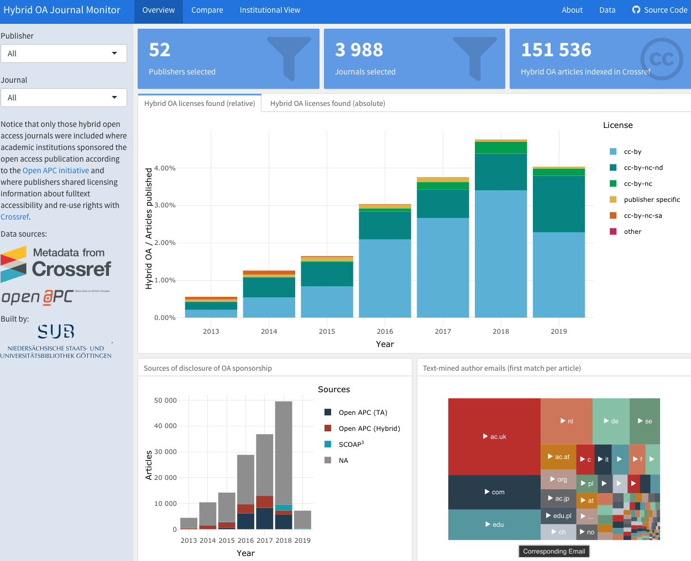

# A reproducible dashboard for monitoring hybrid open access uptake with R

Source code and data repository for the hybrid open access dashboard, using [flexdashboard](https://rstudio.github.io/flexdashboard) and [shiny](http://shiny.rstudio.com).

A live demo is available here:

<https://subugoe.shinyapps.io/hybridoa/>

Summary of methods used and findings:

<https://subugoe.github.io/hybrid_oa_dashboard/about.html>



## Requirements

```r
install.packages(c("flexdashboard", "dplyr", "readr", "plotly", "scales", "ggalt"), dependencies = TRUE)
```

## Running the dashboard locally

```r
rmarkdown::run("dashboard.Rmd")
```

## Methods and data

Methods used are available in the R folder. [`R/cr_fetching.R`](R/cr_fetching.R) describes how licensing and journal metadata were obtained from [Crossref](https://www.crossref.org/), using the [rcrossref](https://github.com/ropensci/rcrossref) client, developed and maintained by the rOpenSci initiative (https://ropensci.org/). [`R/cr_match.R`](R/cr_match.R) shows how the dataset were merged together and how the count data used for the dashboard were calculated. 

<!--For a long-form documentation, see [about.md](about.md)-->

Comprehensive metadata about hybrid open access articles found are shared as well. See this [overview](data/README.md) about how datasets are coded to facilitate analysis.


## How to contribute?

This dashboard has been developed in the open using open tools. There are a number of ways you can help make the dashboard better:

- If you don’t understand something, please let me know and submit an issue.

- Feel free to add new features or fix bugs by sending a pull request.

Please note that this project is released with a [Contributor Code of Conduct](CONDUCT.md). By participating in this project you agree to abide by its terms.

## Meta

License: MIT

Datasets are released into the public domain.

Anyone is free to copy, modify, publish, use, compile, sell, or distribute these materials in any form, for any purpose, commercial or non-commercial, and by any means.

Crossref asserts no claims of ownership to individual items of bibliographic metadata and associated Digital Object Identifiers (DOIs) acquired through the use of the Crossref Free Services. Individual items of bibliographic metadata and associated DOIs may be cached and incorporated into the user's content and systems.

Open APC Data are made available under the Open Database License: http://opendatacommons.org/licenses/odbl/1.0/. Any rights in individual contents of the database are licensed under the Database Contents License: http://opendatacommons.org/licenses/dbcl/1.0/.
