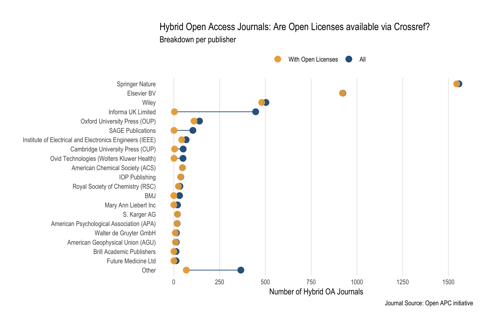
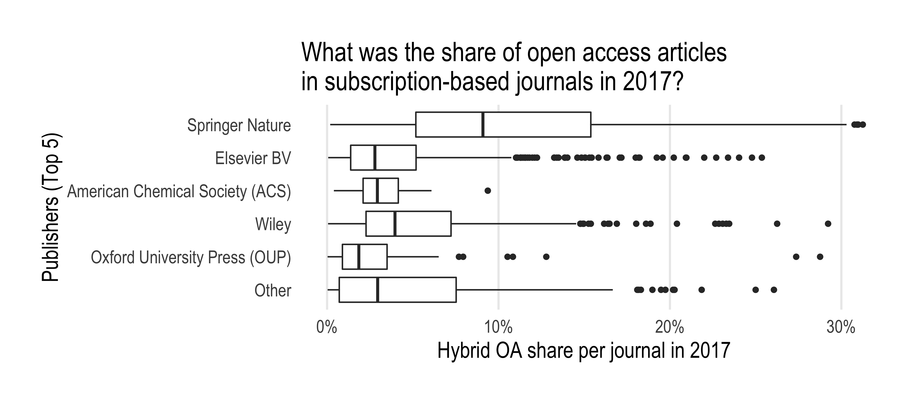
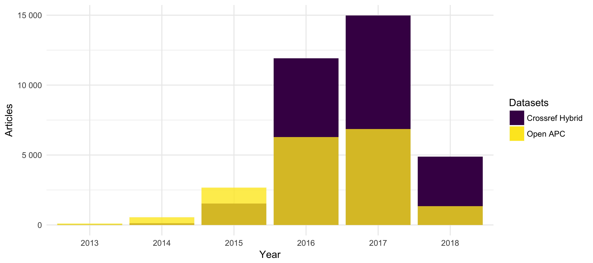

```{r, echo = FALSE}

knitr::opts_chunk$set(
  comment = "#>",
  collapse = TRUE,
  warning = FALSE,
  message = FALSE,
  echo = FALSE,
  fig.width = 9,
  fig.height = 6
)
options(scipen = 999, digits = 2)
knitr::knit_hooks$set(inline = function(x) {
      if(is.numeric(x)){
          return(prettyNum(x, big.mark=","))
      }else{
          return(x)
       }
   })
```

```{r}
# load dplyr 
library(dplyr)
#' load facets results
jn_facets <- jsonlite::stream_in(file("../data/jn_facets_df.json"), verbose = FALSE) 
#' get hybrid journals that have open licensing information in the period 2013-18
hybrid_cr <- readr::read_csv("../data/hybrid_publications.csv") %>%
  mutate(year = factor(issued, levels = c("2013", "2014", "2015","2016", "2017", "2018", "2019"))) %>%
  arrange(desc(yearly_publisher_volume))

o_apc_df <- readr::read_csv("../data/oapc_hybrid.csv") %>% 
  mutate(year = factor(period, levels = c("2013", "2014", "2015","2016", "2017", "2018", "2019"))) 
```

## Summary 

[This open source dashboard](https://subugoe.shinyapps.io/hybridoa/) presents the uptake of hybrid open access for `r dplyr::n_distinct(hybrid_cr$journal_title)` different journals from `r dplyr::n_distinct(hybrid_cr$publisher)` publishers between 2013 - 2019. During this six years period, `r dplyr::n_distinct(hybrid_cr$doi_oa)` articles were made openly available immediately in these subscription-based journals, representing `r unlist(dplyr::n_distinct(hybrid_cr$doi_oa) / (hybrid_cr %>% distinct(issued, yearly_all) %>% summarize(prop = sum(yearly_all))) * 100)`% of the total article volume studied.

Hybrid open access journals are included when they meet the following two conditions:

1. academic institutions sponsored the publication fee or enabled open access publication through an offsetting agreement according to the [Open APC initiative](https://github.com/openapc/openapc-de),
2. publishers shared licensing information about fulltext accessibility and re-use rights with  [Crossref](https://www.crossref.org/).

By bringing together openly available datasets about hybrid open access into one easy-to-use tool, this dashboard demonstrates how existing pieces of an evolving and freely available data infrastructure for monitoring scholarly publishing can be re-used to gain a better understanding of hybrid open access publishing. It, thus, contributes to recent calls from the [Open Access 2020 Initiative](https://oa2020.org/) and [Open Knowledge](https://blog.okfn.org/2017/10/24/understanding-the-costs-of-scholarly-publishing-why-we-need-a-public-data-infrastructure-of-publishing-costs/) aiming at a data-driven debate about how to transition subscription-based journal publishing to open access.

This document gives information about the study design, as well as how to use the dashboard. Because this open source dashboard was built around already existing infrastructure services for scholarly publishing, discussion will also include guidance about how publishers can properly report hybrid open access journal articles to Crossref in accordance with evolving standards like the [ESAC guidelines](http://esac-initiative.org/its-the-workflows-stupid-what-is-required-to-make-offsetting-work-for-the-open-access-transition/).

## Background and motivation

Many publishers offer hybrid open access journals [@Suber_2012]. However, because of non-standardised reporting practices, it is hard to keep track of how many articles these journals provided immediately in open access, and to what extent these figures relate to the overall article volume published [@Bj_rk_2017]. In particular, determining subscription-based journals that already did publish open access articles, as well as obtaining proper licensing information about access and re-use rights is challenging [@Laakso_2016; @Piwowar_2017].

Along with the discoverability of hybrid open access articles, there is also considerable debate about the transparency of this publishing model. In addition to subscriptions as a revenue source, hybrid open access journals often charge publication fees, also known as article processing charges (APC), to provide immediate open access to individual articles [@Suber_2012]. Although some funders and libraries have begun to share expenditures for hybrid open access journals [@Jahn_2016], it remains unclear to which extent such these spendings contribute to the transition of subscribtion-based journals to open access, and how cost-effective they were [@Bj_rk_2014; @Pinfield_2017]. Calls from the [Open Access 2020 Initiative](https://oa2020.org/), [LIBER](https://libereurope.eu/blog/2017/09/07/open-access-five-principles-for-negotiations-with-publishers/) and, most recently, the [COALITION S and its Plan S](https://www.coalition-s.org/), have taken up the problem of transparency, demanding a data-driven discussion about open access provided by subscription-based journals.

To improve the discoverability and transparency of hybrid open access publishing, funders and libraries have implemented compliance criteria. The Wellcome Trust developed a comprehensive set of metadata obligations. The funder also [automatically checks](https://compliance.cottagelabs.com/docs) if authors and publishers comply with the requirements. Chorus, a US-based non-profit serving more than 50 publishers, presents metadata compliance for dedicated funders with [interactive dashboards](https://dashboard.chorusaccess.org/). The [ESAC Initiative](http://esac-initiative.org/), based at the German Max Planck Digital Library (MPDL), released guidelines about how to implement transformative agreements in which subscription and open access publication are considered together [@Geschuhn_2017]. These guidelines expect publishers to provide rich metadata to Crossref, a DOI registration agency for scholarly works, including open access license information, as well as to report covered articles to libraries. Some library consortia like the Swedish Bibsam or the British Jisc have started to make these reports openly available with the [Open APC Initiative](https://github.com/openapc/openapc-de) to increase the transparency of transformative agreements [@Lund_n_2018; @Pieper_2018]. 

These developments show that rich and open publication metadata along with spending information are critical to assessing hybrid open access publishing. To encourage good data practices when monitoring the transition of subscription-based journals to open access, we built this analytical dashboard where a hybrid open access journal must have the following characteristics to become included:

1. Academic institutions sponsored immediate open access publication of individual articles in a subscription-based journal according to the Open APC initiative 
2. Publishers provide rich license metadata to Crossref including information about when the article has become openly available

To our knowledge, this is the first approach that combines openly available data about the productivity of and the spending for hybrid open access journals. It, thus, contributes to recent calls from the [Open Access 2020 Initiative](https://oa2020.org/) and [Open Knowledge](https://blog.okfn.org/2017/10/24/understanding-the-costs-of-scholarly-publishing-why-we-need-a-public-data-infrastructure-of-publishing-costs/) aiming at eliciting a data-driven debate about how to transition subscription-based journal publishing to open access. 

## Data and methods 

To reflect the challenge of finding hybrid open access journals with published open access articles, we started with a sample of hybrid open access journals from the [Open APC initiative](https://github.com/OpenAPC/openapc-de/). This open data initiative crowd-source information about spending on open access journal articles from various international research organisations. [Its openly available dataset](https://github.com/OpenAPC/openapc-de/blob/master/data/apc_de.csv) differentiates expenditure for articles published in hybrid and in fully open access journals. It also has a dedicated dataset containing information about articles, which were made openly available as part of [offsetting deals](https://github.com/OpenAPC/openapc-de/tree/master/data/offsetting), central agreements between publishers and large research organisations or consortia aiming at transitioning subscription-based licensing to open access business models. Using data from the [Open APC initiative](https://github.com/OpenAPC/openapc-de/), thus, ensured that only hybrid open access journals with at least one centrally funded open access article were examined.

After obtaining data about hybrid open access journals from the Open APC initiative, [Crossref's REST API](https://github.com/CrossRef/rest-api-doc) was queried to discover open access articles published in these journals, as well as to retrieve yearly article volumes for the period 2013 - 2019. Using the [rcrossref](https://github.com/ropensci/rcrossref) client, developed and maintained by the [rOpenSci initiative](https://ropensci.org/), the first API call retrieved all licenses URLs available per ISSN. To control developments of the publishing market resulting in name changes of publishers or journal titles over time, only the most frequent facet field name was used. After matching and normalizing  licensing URLs indicating open access articles with the help of the [dissem.in / oaDOI access indicator list](https://github.com/dissemin/dissemin/blob/0aa00972eb13a6a59e1bc04b303cdcab9189406a/backend/crossref.py#L89), a second API call checked licensing metadata to exclude delayed open access articles by using the [Crossref's REST API filters](https://github.com/CrossRef/rest-api-doc#filter-names) `license.url` and `license.delay` for the every single year in period of 2013 - 2019. Because journal business models can change from hybrid to fully open access over time, the [Directory of Open Access Journals (DOAJ)](https://doaj.org/), a curated list of fully open access journals, was finally checked to exclude these journals by ISSNs. To improve this matching, DOAJ data was enriched with further ISSN variants from  @Rimmert_2017.

Notice that although Crossref covers most open access journals disclosed by the Open APC initiative, not all publishers shared comprehensive metadata about access and re-use including licenses and embargo date via Crossref. In our case, `r n_distinct(hybrid_cr$publisher)` publishers provided licensing
metadata via the Crossref API, representing `r (n_distinct(hybrid_cr$publisher) / n_distinct(jn_facets$publisher)) * 100` % of all publishers studied. At the journal-level, `r (n_distinct(hybrid_cr$journal_title) /  n_distinct(jn_facets$journal_title)) * 100` % of all hybrid open access journal titles covered by the Open APC initiative shared proper licensing metadata with Crossref. Figure 1 provides a breakdown of licencing metadata coverage per publisher.


```{r fig.path="../figure/"}
library(ggplot2)
library(ggalt)
library(scales)
library(tidyr)
n_journals_df <- jn_facets %>% 
  distinct(journal_title, publisher) %>%
  mutate(publisher = ifelse(grepl("Springer", publisher, fixed = FALSE, ignore.case = TRUE),
                            "Springer Nature", publisher)) %>%
  group_by(publisher) %>%
  summarise(n_journals = n_distinct(journal_title))
#' all journals from open apc dataset for which we retrieved facet counts 
#' AND from licensing info from crossref 
n_hoa_df <- hybrid_cr %>%
  distinct(journal_title, publisher) %>%
  group_by(publisher) %>%
  summarise(n_hoa_journals = n_distinct(journal_title))
#' merge them into one dataframe
cvr_df <- left_join(n_journals_df, n_hoa_df, by = "publisher") %>%
#' and prepare analysis of top 10 publishers   
  tidyr::replace_na(list(n_hoa_journals = 0)) %>%
  arrange(desc(n_journals)) %>%
  mutate(publisher = forcats::as_factor(publisher)) %>%
  mutate(publisher = forcats::fct_other(publisher, drop = publisher[21:length(publisher)])) %>%
  ungroup() %>%
  group_by(publisher) %>%
  summarise(n_journals = sum(n_journals), n_hoa_journals = sum(n_hoa_journals))
# 
cvr_df_2 <- tidyr::gather(cvr_df, group, value, -publisher)

#' plot
gg <- ggplot(cvr_df, aes(y = publisher)) +
  geom_point(data = cvr_df_2, aes(x = value, color = group), size = 3.5) +
  ggalt::geom_dumbbell(aes(x = n_journals, xend = n_hoa_journals),
    colour="#30638E",
    colour_xend="#EDAE49",
    colour_x="#30638E",
    size_x=3.5,
    alpha = 0.9,
    size_xend = 3.5
    ) +
  scale_y_discrete(limits = rev(levels(cvr_df$publisher))) +
  scale_x_continuous(breaks = seq(0, 1500, by = 250)) +
  labs(x = "Number of Hybrid OA Journals", 
       y = NULL,
       title = "Hybrid Open Access Journals: Are Open Licenses available via Crossref?",
       subtitle = "Breakdown per publisher",
       caption = "Journal Source: Open APC initiative"
  ) +
 # geom_text(data=cvr_df, 
 #            aes(x=850, y= "Elsevier BV", label="with Crossref licensing infos"),
 #            color="#EDAE49", hjust=1, size=3, nudge_x=-10) +
 #  geom_text(data=cvr_df, 
 #            aes(x=900, y= "Elsevier BV", label="All"),
 #           color="#30638E", hjust=0, size=3, nudge_x=10) +
  scale_color_manual(name = "", values = c("#EDAE49", "#30638E"), labels = c("With Open Licenses", "All")) + 
  theme_minimal(base_family="Arial Narrow") +
  theme(plot.margin=margin(30,30,30,30)) +
  theme(panel.grid.minor=element_blank()) +
  theme(axis.ticks=element_blank()) +
  theme(panel.grid.major.y=element_blank()) +
  theme(panel.border=element_blank()) +
  theme(legend.position="top")
ggsave(gg, path = "../img/", filename = "licensing_coverage.png", width = 9, height = 6, dpi = 450, device = "png")
```



*Figure: Overview of Crossref licensing coverage per publisher. Yellow dots represent the number of hybrid open access journals disclosed by the Open APC initiative with licensing metadata, blue dots the overall number of hybrid open access journals in our sample.*

Data were gathered on `r format(file.info("../data/hybrid_license_dois.json")$ctime, "%Y-%m-%d")`. Methods were implemented in R and were made openly available in the source code repository of this project hosted on [GitHub](https://github.com/subugoe/hybrid_oa_dashboard) together with the compiled datasets. A [Shiny web application](https://shiny.rstudio.com/) was built to present the results using [flexdashboard](http://rmarkdown.rstudio.com/flexdashboard/) package. The app is powered by the graphic packages [plotly](https://github.com/ropensci/plotly), [ggplot2](http://ggplot2.tidyverse.org/) and [ggalt](https://github.com/hrbrmstr/ggalt), as well as  [readr](http://readr.tidyverse.org/) for data import. Data analysis made use of [dplyr](http://dplyr.tidyverse.org/).


## Results 

Using data from Open APC and Crossref, we found `r n_distinct(hybrid_cr$doi_oa)`  open access articles published in
`r dplyr::n_distinct(hybrid_cr$journal_title)` subscription-based journals from `r dplyr::n_distinct(hybrid_cr$publisher)` publishers between 2013 - 2019. These articles accounted for about `r unlist(dplyr::n_distinct(hybrid_cr$doi_oa) / (hybrid_cr %>% distinct(issued, yearly_all) %>% summarize(prop = sum(yearly_all))) * 100)`% of the overall journal article volume investigated.

Results at the publisher and journal level are accessible and browsable through an [interactive dashboard using dynamic graphs](https://subugoe.shinyapps.io/hybridoa/). Launching the app shows up the overall results that can be subsetted by publisher or journal via the select boxes in the left sidebar. Publisher names are decreasingly sorted according to the number of hybrid open access articles published. Corresponding journals are filtered conditionally to the publisher selection and are sorted alphabetically.


### Hybrid OA uptake

The upper part of the dashboard allows to explore the annual development of hybrid open access publishing between 2013 - 2019. The first tab shows the relative uptake of hybrid open access, the second tab the absolute number of published hybrid open access articles on a yearly basis. Bar charts are sub-grouped according to the licensing links found via Crossref. Overall results indicate that the number and proportion of hybrid open access journal articles rose between 2013 (`r hybrid_cr %>% filter(year == 2013) %>% n_distinct(hybrid_cr$doi_oa)` articles, OA share: `r unlist((hybrid_cr %>% filter(year == 2013) %>% n_distinct(hybrid_cr$yearly_all) / hybrid_cr %>% filter(year == 2013) %>% distinct(yearly_all)) * 100)` %) and 2017  (`r hybrid_cr %>% filter(year == 2017) %>% n_distinct(hybrid_cr$yearly_all)` articles, OA share: `r unlist((hybrid_cr %>% filter(year == 2017) %>% n_distinct(hybrid_cr$yearly_all) / hybrid_cr %>% filter(year == 2017) %>% distinct(yearly_all)) * 100)` %).


```{r}
hybrid_overview <- hybrid_cr %>%
  group_by(publisher) %>%
  summarize(`Number of journals` = n_distinct(journal_title), 
            `Hybrid OA article volume` = n_distinct(doi_oa))
top3 <- hybrid_overview %>%
  arrange(desc(`Number of journals`)) %>%
  slice(1:3) 
```

Table 1 presents an additional breakdown by publishers, contrasting the number of journals with the number of articles found. The three publishers Elsevier BV, Springer Nature and Wiley-Blackwell are leading, accounting for the largest proportion of hybrid open access journals (`r round(sum(top3$"Number of journals") / sum(hybrid_overview$"Number of journals") * 100, 2)` %) and open access articles (`r round(sum(top3$"Hybrid OA article volume") / sum(hybrid_overview$"Hybrid OA article volume") * 100, 2)` %) found.


```{r}
hybrid_cr %>%
  distinct(publisher, year, yearly_publisher_volume) %>%
  group_by(publisher) %>%
  summarise(`Article volume` = sum(yearly_publisher_volume, na.rm = TRUE)) %>%
  left_join(hybrid_overview, by = "publisher") %>%
  mutate(`OA proportion per publisher (in %)` = round(`Hybrid OA article volume`  / `Article volume` * 100, 2)) %>% 
  mutate(`Overall OA proportion (in %)` = round(`Hybrid OA article volume`  / sum(`Hybrid OA article volume`) * 100, 2)) %>% 
  mutate(`Journal proportion (in %)` = round(`Number of journals` / sum(`Number of journals`) * 100, 2)) %>%
  mutate(`Journals (in %)` = paste0(`Number of journals`, " (" ,`Journal proportion (in %)`, " %)")) %>% 
  mutate(`Article volume (in %)` = paste0(`Article volume`, " (", round(`Article volume` / sum(`Article volume`) * 100, 2), " %)")) %>%
  arrange(desc(`Article volume`)) %>%
  select(Publisher = publisher,`Journals (in %)`, `Article volume (in %)`,4:6)
```

*Table 1: Hybrid open access journal and article breakdown by publisher.*

```{r}
library(tidyverse)
my_df <- hybrid_cr %>% 
  filter(year == "2017") %>% 
  group_by(journal_title, publisher, yearly_jn_volume) %>% 
  summarise(n = n()) %>% 
  mutate(prop = n / yearly_jn_volume) %>%
  ungroup() %>%
  mutate(publisher = forcats::as_factor(publisher)) -> my_df
publishers <- fct_count(my_df$publisher, sort = TRUE) %>%
  .$f
my_df %>% mutate(publisher = forcats::fct_other(publisher, keep = publishers[1:5])) -> my_df
```

Numbers and proportion of hybrid open access journal articles varies across publishers and journals. In the year 2017, for example, the mean open access proportion per Springer Nature journal was `r my_df %>% filter(publisher == "Springer Nature") %>% .$prop %>% mean() * 100` % (SD = `r my_df %>% filter(publisher == "Springer Nature") %>% .$prop %>% sd() * 100` %), whereas the  mean open access articles proportion per journal published by Elsevier BV was `r my_df %>% filter(publisher == "Elsevier BV") %>% .$prop %>% mean() * 100` % (SD = `r my_df %>% filter(publisher == "Elsevier BV") %>% .$prop %>% sd() * 100` %). Figure 3 shows the variations for the five publishers with the largest number of hybrid open access journals in 2017 according to our data.

```{r}
library(scales)
q <- ggplot(my_df, aes(publisher, prop)) + 
  geom_boxplot() + 
  scale_x_discrete(limits = rev(levels(my_df$publisher))) +
  scale_y_continuous(labels = scales::percent) +
  coord_flip(ylim = c(0,0.3)) +
  #scale_y_continuous(labels = scales::percent, limit = c(0,1)) +
  labs(y = "Hybrid OA share per journal in 2017", x = "Publishers (Top 5)",
       title = "What was the share of open access articles \nin subscription-based journals in 2017?") +
  # mimicking github.com/hrbrmstr/hrbrthemes 
  theme_minimal(base_family="Arial Narrow", base_size = 16) +
  theme(plot.margin=margin(30,30,30,30)) +
  theme(panel.grid.minor=element_blank()) +
  theme(axis.ticks=element_blank()) +
  theme(panel.grid.major.y=element_blank()) +
  theme(panel.border=element_blank()) 
ggsave(q, path = "../img/", filename = "oa_variation.png", width = 9, height = 4, dpi = 450, device = "png")
```  



*Figure 3: Box plot characterizing spread and differences of the share of open access articles provided by subscription-based journal per publisher in 2017 using five summary statistics (the median, the 25th and 75th percentiles, and 1.5 times the inter-quartile range between the first and third quartiles), and visualizing all outlying points individually.*

### Institutional support

In addition to bibliographic metadata, institutional support either for publication fees or as part of central agreements between research organisations and publishers (offsetting) was also studied.
The lower left chart in the dashboard compares the number of articles found via Open APC and Crossref for the selection. The lower right chart indicates from which countries the institutional support originated from. 

Notice that it is very likely that the overall decrease of spending for hybrid open access reported to the Open APC initiative in 2019 is due to a lag between the time that payments were made and expenditures were reported to the initiative. Comparing the number of articles found via Open APC and Crossref, furthermore suggests that not all publishers share licensing metadata retrospectively. Take for instance journals published by Springer Nature: between 2013 and 2015 more open access articles were reported to the Open APC initiative than registered with an open license via Crossref (see Figure 2). 

```{r}
hybrid_springer <- hybrid_cr %>%
    filter(publisher == "Springer Nature")

  hybrid_sub <- hybrid_springer %>%
    group_by(year) %>%
    summarize(n = n_distinct(doi_oa)) %>%
    mutate(source = "Crossref Hybrid")

  o_apc_sub <- o_apc_df %>%
    filter(journal_full_title %in% hybrid_springer$journal_title, period %in% hybrid_springer$year) %>%
    group_by(year) %>%
    summarize(n = n()) %>%
    mutate(source = "Open APC")

  p <- ggplot(hybrid_sub, aes(year, n, fill = source)) +
    geom_bar(stat = "identity", position = "dodge") +
    xlab("Year") +
    ylab("Articles") +
    scale_x_discrete(drop = FALSE) +
    viridis::scale_fill_viridis("Datasets", discrete = TRUE) +
    scale_y_continuous(labels=function(x) format(x, big.mark = " ", scientific = FALSE),
                       breaks= pretty_breaks()) +
    theme_minimal()
  p <- p + geom_bar(data = o_apc_sub, aes(year, n, fill = source), stat = "identity", alpha = 0.8)
  ggsave(p, path = "../img/", filename = "oapc_cr_springer.png", width = 9, height = 4, dpi = 450, device = "png")
```


*Figure 2: Comparing Springer Nature hybrid open access journal articles available via Crossref with  disclosed spending information via the Open APC initiative.*


## Discussion and conclusion

This dashboard demonstrates the uptake of hybrid open access publishing for a sample of subscription-based journals where institutional support facilitated the open access publication of individual articles, and where licensing metadata about the open access status were made available via Crossref. In using open data sources and tools to analyse and present these data, this dashboard demonstrates how monitoring of hybrid open access can become more transparent and reproducible.

The presented longitudinal findings are consistent with earlier studies, confirming the growth of hybrid open access publishing. According to @Laakso_2016 hybrid open access publishing increased between 2007 - 2013. The authors identified 13,994 hybrid open access articles published in 2,714 different journals during 2013. @Bj_rk_2017 also observed an increase since 2014, presumably because of  centralized agreements with large publishers. Notably Springer Nature has started to offer offsetting deals to large research organisations like the Max Planck Society and national consortia since then [@Geschuhn_2017]. But also recent funding policies in favor of hybrid open access, notably in the UK, likely influenced the uptake of hybrid open access publishing [@Pinfield_2017].

While our findings confirm the uptake of hybrid open access in recent years, related studies observed higher proportions of freely available articles in hybrid open access journals. Studying subscription-based journals with at least one identified hybrid open access article as well, @Laakso_2016 determined an open access share of 3.8 % for the period of 2011–2013. Using Crossref metadata, @Piwowar_2017 estimated an even higher proportion according to which 9.4 % of articles published in 2015 were provided as hybrid open access. Our future work will, therefore, focus on evaluation our retrieval strategy in terms of precision and recall in order to better understand these differences. 

@Piwowar_2017 also found that the percentage of open access provided by publishers, which was free to read, but where the journal was neither listed in the DOAJ nor provided licensing metadata, was even higher (17.6 %). Our study confirms that metadata workflows for hybrid open access publishing as suggested by initiatives like [ESAC](http://esac-initiative.org/) are not comprehensively implemented, yet. Only every fifth publisher in our sample shared licensing metadata via Crossref. In addition to this incomplete licensing coverage, our findings also suggest a gap between spending information available through the Open APC initiative and the total number of hybrid open access articles that have been registered with Crossref in recent years. A likely reason is that reporting to the Open APC initiative is voluntary [@Jahn_2016]. Therefore, presumably not all institutions contribute cost data or information about central aggrements to this initiative. However, not all hybrid open access articles were sponsored by institutions, but authors can make use of other resources to publish open access, or fees are waived [@Solomon_2011]. 

As institutional support of hybrid open access journals grows, the overall aim of this dashboard is to promote evolving standards and infrastructures for analyzing the transition of subscription-based journal publishing to open access. Crossref provides excellent guidance for publishers to make licensing metadata available via the Crossref APIs:
<https://support.crossref.org/hc/en-us/articles/214572423-License-metadata-Access-Indicators->. For being best represented in this dashboard, publishers will have to make sure to include license URL element `license_ref` and a `start_date` equal to the date of publication in the licensing metadata, which helps to identify open access journal content as well as to differentiate between immediate and delayed open access. Likewise, research institutions, funders, and libraries can increase transparency about hybrid open access publishing including offsetting deals by reporting funded articles to the Open APC initiative on a regular basis. Both practices comply with [ESAC's recommendation for article workflows and services for offsetting/ open access transformation agreements](http://esac-initiative.org/its-the-workflows-stupid-what-is-required-to-make-offsettin). As this dashboard demonstrates, following these guidelines will help to extend existing methods and data sources to monitor the transition of subscription-based journal publishing to open access in an open and transparent way.

## Meta

### How to contribute?

Dashboard and analysis have been developed in the open using open tools. There are a number of ways you can help make the this work better:

- If you don’t understand something, please let us know and [submit an issue](https://github.com/subugoe/hybrid_oa_dashboard/issues).

- Feel free to add new features or fix bugs by sending a [pull request](https://github.com/subugoe/hybrid_oa_dashboard/pulls).

Please note that this project is released with a [Contributor Code of Conduct](https://github.com/subugoe/hybrid_oa_dashboard/CONDUCT.md). By participating in this project you agree to abide by its terms.

Author: Najko Jahn (Scholarly Communication Analyst, [SUB Göttingen](https://www.sub.uni-goettingen.de/)), 2017.

The R Markdown file, which includes the underlying source code for this document, is available [here](https://github.com/subugoe/hybrid_oa_dashboard/blob/master/docs/about.Rmd).

<a rel="license" href="http://creativecommons.org/licenses/by/4.0/"></a><br />This work is licensed under a <a rel="license" href="http://creativecommons.org/licenses/by/4.0/">Creative Commons Attribution 4.0 International License</a>.

## Bibliography
