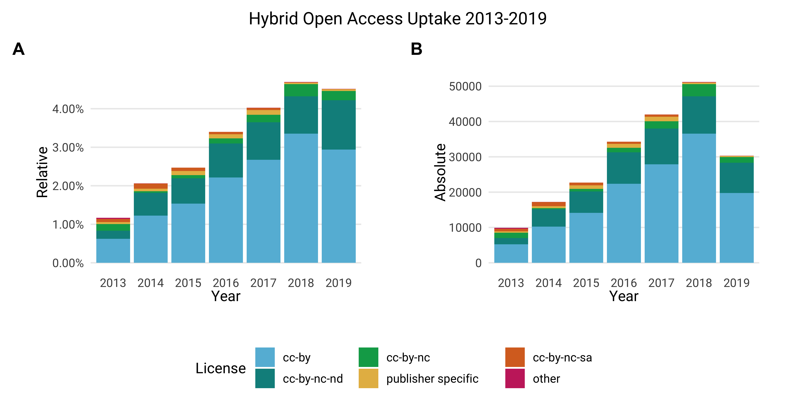
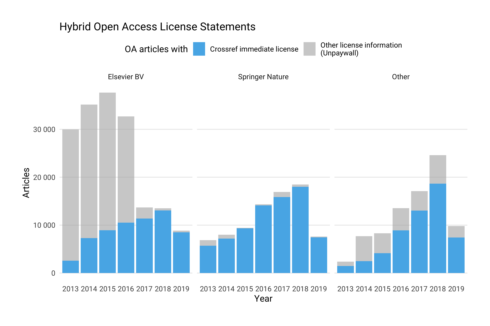
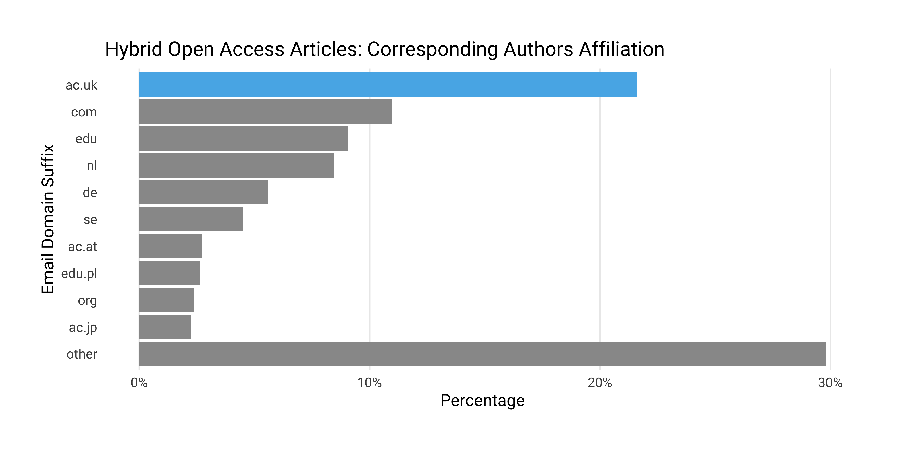
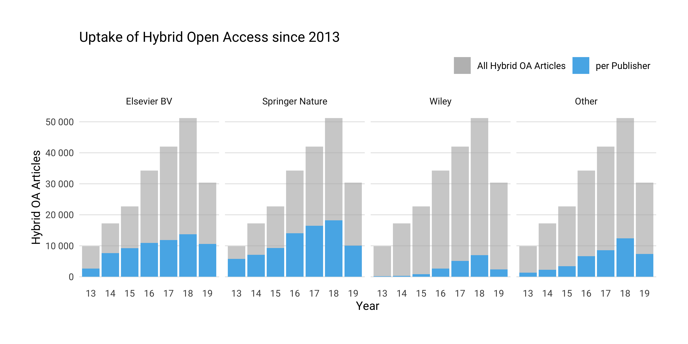

```{r, echo = FALSE}
knitr::opts_chunk$set(
  comment = "#>",
  collapse = TRUE,
  warning = FALSE,
  message = FALSE,
  echo = FALSE,
  fig.width = 9,
  fig.height = 6
)
options(scipen = 999, digits = 2)
knitr::knit_hooks$set(inline = function(x) {
      if(is.numeric(x)){
          return(prettyNum(x, big.mark=","))
      }else{
          return(x)
       }
   })
```

```{r}
# load packages 
library(tidyverse)
library(jsonlite)
library(ggalt)
library(scales)
#' load facets results
jn_facets <- jsonlite::stream_in(file("../data/jn_facets_df.json"), verbose = FALSE) 
#' get hybrid journals that have open licensing information in the period 2013-18
hybrid_cr <- readr::read_csv("../data/hybrid_publications.csv") %>%
  mutate(license = fct_infreq(license)) %>%
  mutate(year = factor(issued, levels = c("2013", "2014", "2015","2016", "2017", "2018", "2019"))) %>%
  arrange(desc(yearly_publisher_volume))

o_apc_df <- readr::read_csv("../data/oapc_hybrid.csv") %>% 
  mutate(year = factor(period, levels = c("2013", "2014", "2015","2016", "2017", "2018", "2019"))) 

unpaywall_df <- readr::read_csv("../data/unpaywall_df.csv") %>%
  mutate(year = factor(year, levels = c("2013", "2014", "2015","2016", "2017", "2018", "2019")))
```

## Summary 

[This open source dashboard](https://subugoe.shinyapps.io/hybridoa/) presents the uptake of hybrid open access for `r dplyr::n_distinct(hybrid_cr$journal_title)` subscription-based journals from `r dplyr::n_distinct(hybrid_cr$publisher)` publishers between 2013 - 2019. During this seven years period, these journals provided immediate open access to `r dplyr::n_distinct(hybrid_cr$doi_oa)` articles, representing `r unlist(dplyr::n_distinct(hybrid_cr$doi_oa) / (hybrid_cr %>% distinct(issued, yearly_all) %>% summarize(prop = sum(yearly_all))) * 100)`% of the total article volume studied.

Hybrid open access journals are included when they share the following two characteristics:

1. Academic institutions sponsored immediate open access publication of individual articles according to the [Open APC initiative](https://github.com/openapc/openapc-de),
2. Publishers provided open content license statements via [Crossref](https://www.crossref.org/) including information about whether articles were made openly available upon publication or not.

By bringing together openly available datasets about hybrid open access into one easy-to-use tool, this dashboard demonstrates how existing pieces of an evolving and freely available data infrastructure for monitoring scholarly publishing can be re-used to gain a better understanding of hybrid open access publishing. It, thus, contributes to recent calls from the [Open Access 2020 Initiative](https://oa2020.org/) and the [cOAlition S with its Plan S ](https://www.coalition-s.org/) aiming at a data-driven debate about how to transition subscription-based journal publishing to open access.

This document gives information about the analytical design, as well as how to use the dashboard. Because this open source dashboard was built around already existing infrastructure services for scholarly publishing, discussion will also include guidance about how publishers can properly report hybrid open access journal articles to Crossref in accordance with evolving standards like the [ESAC Guidelines for Transformative Agreements](https://esac-initiative.org/about/transformative-agreements/guidelines-for-transformative-agreements/).

## Background and motivation

Many publishers offer hybrid open access journals [@Suber_2012]. However, because of non-standardized reporting practices, it is hard to keep track of how many articles these journals provided in open access, and to what extent these figures relate to the overall article volume published [@Bj_rk_2017]. In particular, determining subscription-based journals that already did publish open access articles, as well as obtaining licensing information about access and re-use rights is challenging [@Laakso_2016; @Piwowar_2017]. Another question is how to distinguish immediate hybrid from delayed open access provision, a publishing model, which a considerable number of journals practise [@Laakso_2013].

While previous bibliometric studies about hybrid open access publishing used reports from publishers [@Bj_rk_2017] or obtained articles manually from publisher websites [@Laakso_2016], [Unpaywall](https://unpaywall.org/) from [Impactstory](https://github.com/impactstory) has become a popular way to find open access publications [@Else_2018]. This openly available discovery service, whose underlying data major bibliometric databases like the Web of Science or Scopus integrate, links DOIs from Crossref, a DOI registration agency for scholarly works, to free full-texts. There are several bibliometric studies and services using Unpaywall to investigate the prevalence of hybrid open access (e.g. @Bosman_2018 or the [German Open Access Monitor](https://open-access-monitor.de/#/)). Following @Piwowar_2017, these approaches determined hybrid open access articles as publisher provided open access not being published in fully open access journals listed in the [Directory of Open Access Journals (DOAJ)](https://doaj.org/). To be characterized as hybrid open access, articles must be published under an open content license as well, an information, which Unpaywall retrieved from Crossref and publisher websites. 

However, using Unpaywall to discover hybrid open access in such a way is limited in two respects: First, there are some fully open access journals, which are not indexed in the DOAJ [@Rimmert_2017], presumably because these journals did not comply with its comprehensive inclusion criteria. Second, Unpaywall focuses on current open access provision, but does not track when an article was made openly available, which, in turn, makes it hard to distinguish between immediate and delayed open access provision using this data source alone.[^3]
<!-- In case of Crossref, the problem of immediacy could be adressed by including the `start_date` attribute from the [license metadata](https://support.crossref.org/hc/en-us/articles/214572423-License-metadata-Access-Indicators-).-->
For these two reasons, Unpaywall is, thus, only partly useful to determine immediate open access to individual articles in subscription-based journals.

The above-described lack of standardized and publicly available data about hybrid open access publishing not only limits its quantitative study, but also informed policy-making around open access [@Laakso_2019]. Particularly, the business model of hybrid open access journals is challenged, because publisher often charge publication fees, also known as article processing charges (APC), to provide immediate open access to individual articles in addition to subscriptions [@Suber_2012]. Although it was initially envisioned that with growing funding opportunities for publication fees publishers would transition hybrid open access journals to fully open access [@Prosser_2003], it remains unclear to which extent the increasing willingness to pay for open access contributed to it, and how cost-effective these spendings were [@Bj_rk_2014; @Pinfield_2017]. 

Funders and libraries have responded to the problems of missing evidence around hybrid open access publishing in the last years. To make expenditures more transparent, a growing number of institutions have started to disclose individual articles they supported as open data. The Wellcome Trust, the Austrian Science Fund FWF and British universities were among the first who shared their spendings for open access articles in hybrid open access journals [@Kiley_2014; @fwf_apc_13; @jisc_14]. The [Open APC Initiative](https://github.com/openapc/openapc-de) collects and standardizes these openly available spending data together with crowd-sourced expenditures. Because Crossref, a DOI registration agency for scholarly works, indexes most articles where institutions sponsored publication fees, Open APC can use its metadata services to make open access expenditures comparable at the institutional, journal and publisher level [@Jahn_2016; @Pieper_2018]. So far, the Open APC Initiative disclosed `r nrow(o_apc_df)` hybrid open access articles supported by `r length(unique(o_apc_df$institution))` research performing organisations and funders between 2013 - 2019.

Additionally, funders and libraries have developed compliance criteria including machine-readable Creative Commons license statements to improve the discoverability of open access content. The Sponsoring Consortium for Open Access Publishing in Particle Physic -- SCOAP$^3$, for example, requires CC-BY licenses and archives funded articles in several formats including metadata in a dedicated repository. In Europe, the Wellcome Trust refers to the life science repository [Europe PubMed Central (Europe PMC)](http://europepmc.org/) for depositing funded articles along with a comprehensive set of metadata. Moreover, the funder [automatically checks](https://compliance.cottagelabs.com/docs) if authors and publishers comply with these obligations [@Kiley_2015]. In its contract with the publisher Wiley, the German DEAL consortium stated comprehensive metadata obligations to be implemented using Crossref and its metadata profile [@Sander_2019]. Likewise, the German Deutsche Forschungsgemeinschaft (DFG) referred to Crossref as metadata service for open access articles published in subscription-based journals in its funding programme ["Open Access Transition Agreements"](https://www.dfg.de/en/research_funding/announcements_proposals/2017/info_wissenschaft_17_12/index.html). In the US, Chorus, a non-profit serving more than 50 publishers, uses freely available metadata from Crossref to present open access compliance for dedicated funders with [interactive dashboards](https://dashboard.chorusaccess.org/). 

In the light of a perceived slow and ineffective growth of open access, more and more funders and libraries alter their spending on subscription-based journals and individual open access articles published in these outlets. Notably, the [Open Access 2020 Initiative](https://oa2020.org/) calls for a transparent approach to converting budgets spent for subscriptions to open access business models. Likewise, the cOAlition S, a network of 11 research funders, released its widely discussed [Plan S](https://www.coalition-s.org/) in September 2018. Starting from 2021S, members of the cOAlition S intend to discontinue funding of publication fees for individual open access articles in subscription-based journals. However, hybrid open access articles published under a transformative agreement, in which spendings for subscription and open access publication are considered together, will remain eligible for funding. The Plan S also requires a commitment to full open access transition from the publishers. Journals providing delayed open access are not compatible with the Plan S.

In its [Plan S implementation planning](https://www.coalition-s.org/principles-and-implementation/) the cOAlition S refers to the [ESAC Initiative](http://esac-initiative.org/), which aims at standardizing open access workflows between publishers and research institutions, to observe the transition process of journals under transformative agreements. In 2017, ESAC, based at the German Max Planck Digital Library (MPDL), released guidance about how to implement transformative agreements. According to these guidelines, publishers have to ensure that only corresponding authors affiliated with the agreement institution are eligible for open access support. Furthermore, publishers need to provide comprehensive metadata to Crossref including open access license information. They are also entitled to report sponsored articles to the agreement institutions [@Geschuhn_2017]. Complementary to spendings for individual hybrid open access articles, some library consortia like the Swedish Bibsam or the British Jisc have begun to make these reports openly available with the Open APC Initiative [@Lund_n_2018; @Pieper_2018]. To support the monitoring of transformative agreements at the publisher-level, ESAC has started an [agreement registry](https://esac-initiative.org/about/transformative-agreements/agreement-registry/) targeting national consortia to disclose their contracts.

These developments show that open and standardized reporting is critical to monitor hybrid open access publishing. Against this background, we investigated the uptake of hybrid open access publishing for journals having the following two characteristics:

1. Academic institutions sponsored immediate open access publication of individual articles according to the Open APC initiative,
2. Publishers provided open content license statements via Crossref including information about whether articles were made openly available upon publication or not.

To our knowledge, this is the first approach that combines openly available data about the productivity of and the spending for hybrid open access journals. Reflecting recent compliance efforts from funders and libraries, it extends existing methods to find hybrid open access articles in two ways: First, it addresses the difficulties to identify hybrid open access journals, which already did publish individual open access articles by using spending information. Second, our approach uses Crossref metadata to exclude delayed open access provision that does not comply with the Plan S.

## Data and methods 

Our methods follow the Wickham-Grolemund approach to practice data science [@Wickham_2017]. After importing, cleaning  ("tidying") and transforming data from various sources, a process called "data wrangling", summary statistics were calculated and visualized to understand and communicate the uptake of hybrid open access publishing. For the latter, we created a dashboard, which allows visual interaction with our data. Our workflow, illustrated in Figure and described more detailed in this section, was implemented in R using open data and tools, making it transparent and re-usable. 

Data were gathered on `r format(file.info("../data/hybrid_license_dois.json")$ctime, "%Y-%m-%d")`. Along with the data, methods are shared in the source code repository of this project, which is hosted on [GitHub](https://github.com/subugoe/hybrid_oa_dashboard). 

![Summary of data and methods used, following the Wickham-Grolemund approach to practice data science [@Wickham_2017]](flow.png)


### Data Analysis

To reflect the challenge of finding hybrid open access journals with published open access articles [@Laakso_2016], we started with a sample of hybrid open access journals from the [Open APC initiative](https://github.com/OpenAPC/openapc-de/). This open data initiative crowd-source information about spending on open access journal articles from various international research organisations. [Its openly available dataset](https://github.com/OpenAPC/openapc-de/blob/master/data/apc_de.csv) differentiates expenditure for articles published in hybrid and in fully open access journals. It also has a dedicated dataset containing information about articles, which were made openly available as part of [transformative agreements](https://github.com/OpenAPC/openapc-de/tree/master/data/offsetting), deals between publishers and large research organisations or consortia aiming at transitioning subscription-based licensing to open access business models. Using data from the [Open APC initiative](https://github.com/OpenAPC/openapc-de/), thus, ensured that only hybrid open access journals with at least one institutionally funded open access article were examined.

After obtaining a list of hybrid open access journals from the Open APC initiative, [Crossref's REST API](https://github.com/CrossRef/rest-api-doc) was queried to discover open access articles published in these journals, as well as to retrieve yearly article volumes for the period 2013 - 2019. Using the [rcrossref](https://github.com/ropensci/rcrossref) client [@rcrossref], developed and maintained by the [rOpenSci initiative](https://ropensci.org/), the first API call retrieved all licenses URLs available per journal using all ISSN variants available in Open APC dataset. To control developments of the publishing market resulting in name changes of publishers or journal titles over time, only the most frequent facet field name was used. We also drew on facet field counts to obtain the yearly article volume per journal from Crossref. After matching licensing URLs indicating open access articles with the help of the [dissem.in / oaDOI access indicator list](https://github.com/dissemin/dissemin/blob/0aa00972eb13a6a59e1bc04b303cdcab9189406a/backend/crossref.py#L89), a second API call checked licensing metadata. Here, we excluded delayed open access articles by using the [Crossref's REST API filters](https://github.com/CrossRef/rest-api-doc#filter-names) `license.url` and `license.delay` for the every single year in period of 2013 - 2019. Next, URLs representing licenses were normalized to Creative Commons or publisher specific open content license statements. Because journal business models can change from hybrid to fully open access over time, the [Directory of Open Access Journals (DOAJ)](https://doaj.org/), a curated list of fully open access journals, was finally checked to exclude these journals by ISSNs. To improve this matching, DOAJ data was enriched with further ISSN variants from @Rimmert_2017. Journals with a OA proportion above 0.95 over two years were also excluded. Because journals can also change from fully open access to a subscription-based business model [@Matthias_2019b], a dataset of reverse flip journals [@Matthias_2019a] was finally used to identify those journals in our sample, and to exclude annual volumes before the conversion from it.

Using Unpaywall data, we were able to determine additional articles with open content license statements, and compared them with our journal sample. After importing the Unpaywall dump to a Google Big Query instance, we searched all articles where license statements were available for the version of record with the bigrquery interface [@bigrquery][^4]. Only articles from 2013 onwards in non-DOAJ indexed journals were considered. Next, we retrieved all ISSN variants for each journal in the Unpaywall sample and matched them with our hybrid open access journal sample. Finally, we compared articles contained in our sample with that of Unpaywall using DOIs. Because [DOI names are case insensitive](https://www.doi.org/doi_handbook/2_Numbering.html#2.4), DOIs were converted to lowercase before the matching.

Information about corresponding authors play a crucial role in open access funding [@Schimmer_2015; @Geschuhn_2017]. Because not all publishers share standardized affiliation data with Crossref, we text-mined our article sample for author emails, assuming that email domains can be used as a rough approximation of the affiliation of the first respective corresponding author at the time of publication. First, we interfaced [PubMed Central's Open Access subset](https://www.ncbi.nlm.nih.gov/pmc/tools/textmining/) and, if the article was not available via PubMed Central, the [Crossref TDM service](https://support.crossref.org/hc/en-us/articles/215750183-Crossref-Text-and-Data-Mining-Services) using [crminer](https://github.com/ropensci/crminer) from rOpenSci [@crminer]. From the so downloaded full-texts, we extracted the first email occurrence per article using pattern matching. Next, we split the email domains in its parts with [urltools](https://CRAN.R-project.org/package=urltools) [@urltools]. To avoid mis-use, particularly academic spamming, source code and data used for this text-mining exercise are currently stored in a privately git-repository until it is secured that no full author emails are accidentally shared.

After exploring the so obtained data, communication is the final step in the Wickham-Grolemund approach to practice data science. Given the increasing demand for data-driven insights about the uptake of hybrid open access, we decided to present our results as an interactive dashboard, an efficient way to communicate results from a data analysis [@Wickham_2017]. To this end, we built a [shiny web application](https://shiny.rstudio.com/) [@shiny] that shows the development of hybrid open access publishing. More specifically, we used the [flexdashboard](http://rmarkdown.rstudio.com/flexdashboard/) package [@flexdashboard] that belongs to the R Markdown authoring framework for data science. This allowed us to code the analytical web application within an R-based data analytics workflow [@rmarkdown_1; @rmarkdown_2], thereby shielding us from complex components written in other programming languages needed for interactive web applications.

Staying in the R-based data analytics workflow enabled us to re-use many R packages, which we also applied for data wrangling and exploration, particularly [dplyr](http://dplyr.tidyverse.org/) [@dplyr] and [tidyr](http://tidyr.tidyverse.org/) [@tidyr]. For data import and storage, we used the packages [readr](http://readr.tidyverse.org/) [@readr] for `csv` and jsonlite [@jsonlite] for `json` files. Furthermore, we were able to convert exploratory visualisations made with [ggplot2](http://ggplot2.tidyverse.org/), a domain specific language for statistical graphs [@ggplot2], to interactive [plotly charts](https://github.com/ropensci/plotly) [@plotly], an open-source charting library written in JavaScript. Additionally, the [echarts4r package](https://echarts4r.john-coene.com/) [@echarts4r], an interface to the javascript-based [Echarts library](https://ecomfe.github.io/echarts-examples/public/index.html), was used for presenting the distribution of email domains and their parts as hierarchical treemaps. 

The dashboard application, written as R Markdown document, is hosted by [shinyapps.io](https://www.shinyapps.io/), and is accessible under the following link: <https://subugoe.shinyapps.io/hybridoa>. Along with the source code for the data analysis and the dashboard, we made all datasets used available via GitHub along with a brief description about which variables they contain: <https://github.com/subugoe/hybrid_oa_dashboard/blob/master/data/README.md>. Using Git, the history of the text-based datasets and source code was tracked, too. 

### Data Accuracy

Notice that our estimates about the extent of hybrid open access publishing are likely to be conservative. Probably not all authors and institutions shared information about hybrid open access spending with the Open APC initiative. Similarly, it is likely that not all publishers reported comprehensive metadata about access and re-use with Crossref, because the DOI registration agency did not mandate license statements for open access content at the time of our study. To assess data accuracy, we first describe how many hybrid open journals covered by the Open APC initiative provided license statements to Crossref between 2013 - 2019. Next, we evaluated the accuracy of our automated retrieval using article random samples. 

#### Coverage accuracy

In the case of hybrid open access journals represented in the Open APC datasets, `r n_distinct(hybrid_cr$publisher)` publishers provided licensing statements via the Crossref API, representing `r (n_distinct(hybrid_cr$publisher) / n_distinct(jn_facets$publisher)) * 100` % of all publishers studied. At the journal-level, `r (n_distinct(hybrid_cr$journal_title) /  n_distinct(jn_facets$journal_title)) * 100` % of all hybrid open access journal titles covered by the Open APC initiative shared open content license statements valid without delay with Crossref. Figure 1 provides a breakdown of licensing metadata coverage per publisher.


```{r fig.path="../figure/"}
n_journals_df <- jn_facets %>%
  distinct(journal_title, publisher) %>%
  mutate(publisher = ifelse(
    grepl(
      "Springer",
      publisher,
      fixed = FALSE,
      ignore.case = TRUE
    ),
    "Springer Nature",
    publisher
  )) %>%
  group_by(publisher) %>%
  summarise(n_journals = n_distinct(journal_title))
#' all journals from open apc dataset for which we retrieved facet counts
#' AND from licensing info from crossref
n_hoa_df <- hybrid_cr %>%
  distinct(journal_title, publisher) %>%
  group_by(publisher) %>%
  summarise(n_hoa_journals = n_distinct(journal_title))
#' merge them into one dataframe
cvr_df <- left_join(n_journals_df, n_hoa_df, by = "publisher") %>%
  #' and prepare analysis of top 10 publishers
  tidyr::replace_na(list(n_hoa_journals = 0)) %>%
  arrange(desc(n_journals)) %>%
  mutate(publisher = forcats::as_factor(publisher)) %>%
  mutate(publisher = forcats::fct_other(publisher, drop = publisher[21:length(publisher)])) %>%
  ungroup() %>%
  group_by(publisher) %>%
  summarise(n_journals = sum(n_journals),
            n_hoa_journals = sum(n_hoa_journals))
#
cvr_df_2 <- tidyr::gather(cvr_df, group, value,-publisher)

#' plot
gg <- ggplot(cvr_df, aes(y = publisher)) +
  geom_point(data = cvr_df_2, aes(x = value, color = group), size = 3.5) +
  ggalt::geom_dumbbell(
    aes(x = n_journals, xend = n_hoa_journals),
    colour = "#30638E",
    colour_xend = "#EDAE49",
    colour_x = "#30638E",
    size_x = 3.5,
    alpha = 0.9,
    size_xend = 3.5
  ) +
  scale_y_discrete(limits = rev(levels(cvr_df$publisher))) +
  scale_x_continuous(breaks = seq(0, 1500, by = 250)) +
  labs(
    x = "Number of Hybrid OA Journals",
    y = NULL,
    title = "Hybrid Open Access Journals:\nAre Open Licenses available via Crossref?",
    subtitle = "Breakdown per publisher",
    caption = "Journal Source: Open APC initiative"
  ) +
  scale_color_manual(
    name = "",
    values = c("#EDAE49", "#30638E"),
    labels = c("With Open Licenses", "All")
  ) +
  theme_minimal(base_family = "Roboto") +
  theme(plot.margin = margin(30, 30, 30, 30)) +
  theme(panel.grid.minor = element_blank()) +
  theme(axis.ticks = element_blank()) +
  theme(panel.grid.major.y = element_blank()) +
  theme(panel.border = element_blank()) +
  theme(legend.position = "top")
ggsave(
  gg,
  path = "../img/",
  filename = "licensing_coverage.png",
  width = 9,
  height = 6,
  dpi = 450,
  device = "png"
)
```


<!-- *Figure 1: Overview of Crossref licensing coverage per publisher. Yellow dots represent the number of hybrid open access journals disclosed by the Open APC initiative with licensing metadata, blue dots the overall number of hybrid open access journals in our sample.*-->


#### Retrieval accuracy 

```{r}
cr_oapc_1 <- readxl::read_xlsx("accuracy/claasen_frage_1_100_dois.xlsx")
cr_oapc_2 <- readxl::read_xlsx("accuracy/claasen_frage_2_100_dois.xlsx")
```

`r o_apc_df %>% filter(tolower(doi) %in% tolower(hybrid_cr$doi_oa)) %>% nrow()` out of `r nrow(o_apc_df)` hybrid open access articles disclosed by the Open APC initiative provided open content license statements valid without delay, representing a proportion of `r o_apc_df %>% filter(tolower(doi) %in% tolower(hybrid_cr$doi_oa)) %>% nrow() / nrow(o_apc_df) * 100` %. To assess the accuracy of our retrieval, we manually checked a random sample of 100 Open APC articles not being found. We determined `r filter(cr_oapc_1, open_content_license == "false") %>% nrow()` articles that did not share license statements with Crossref using the license node. The other `r filter(cr_oapc_1, open_content_license == "true", immediate_oa == "false") %>% nrow()` articles did report an open content license, but with a delay (`delay-in-days` metadata field) above 0 days.[^1]

Drawing another random sample of 100 articles, we manually validated if we obtained the correct license statements including start date from the Crossref API. We also evaluated if all journal articles were original articles or reviews. For all articles, we extracted the same data as represented in the Crossref metadata using our methods. `r cr_oapc_2 %>% filter(typ == "journal-article") %>% nrow()` articles were characterized as original article or review, confirming previous studies [@Piwowar_2017]. Other document types were conference abstracts (N = `r cr_oapc_2 %>% filter(typ == "abstract") %>% nrow()`), a medical guideline, a comment and a short report.

We were able to retrieve emails for `r hybrid_cr %>% filter(!is.na(suffix)) %>% nrow() / nrow(hybrid_cr) * 100` % of all articles in our dataset. Furthermore, recall and precision for obtaining and extracting email addresses from full-texts were investigated using a random sample of 200 articles. Recall asked if all author email addresses were found. Precision asked if the first author email match was correct. While all first email addresses were correctly parsed (precision = 1), 40 articles contained more than one email from authors (recall = 0.8). In two cases, the corresponding author named two emails.[^2] 

<!-- Next, we evaluated the accurary of our automated methods using article random samples. Recall and precision for obtaining hybrid open access articles from Crossref and for extracting email addresses from full-texts were investigated. -->


## Results 

Using data from Open APC and Crossref, we found `r n_distinct(hybrid_cr$doi_oa)`  open access articles published without delay in
`r dplyr::n_distinct(hybrid_cr$journal_title)` subscription-based journals from `r dplyr::n_distinct(hybrid_cr$publisher)` publishers between 2013 - 2019. These hybrid open access articles accounted for about `r unlist(dplyr::n_distinct(hybrid_cr$doi_oa) / (hybrid_cr %>% distinct(issued, yearly_all) %>% summarize(prop = sum(yearly_all))) * 100)`% of the overall journal article volume investigated.

In the following, we present the functionality of our [interactive dashboard](https://subugoe.shinyapps.io/hybridoa/), and highlight key findings from our exploratory data analysis. The dashboard itself is divided into three pages, which are accessible through the navigation bar. The first page, ["Overview"](https://subugoe.shinyapps.io/hybridoa/#section-overview) shows a summary of the overall results. They can be subsetted by a publisher or journal using the select boxes in the left sidebar. Theses boxes support browsing and searching. The second page, ["Compare"](https://subugoe.shinyapps.io/hybridoa/#section-compare), let you analyze the uptake of hybrid open access across publisher and years. The third page, ["Institutional View"](https://subugoe.shinyapps.io/hybridoa/#section-institutional-view), is similar to the first page, but allows browsing by email domains instead of publishers and journals.

### Overview: Longitudinal development of hybrid open access publishing 

#### Uptake and proportion of hybrid open access

Launching the app shows up the overall results that can be subsetted by publisher or journal via the select boxes in the left sidebar. Publisher names are decreasingly sorted according to their total article volume. Journals are filtered conditionally to the publisher selection and are sorted alphabetically.

<!--  -->

The upper part of the dashboard allows to explore the annual development of hybrid open access publishing between 2013 - 2019. The first tab shows the relative uptake of hybrid open access, the second tab the absolute number of published hybrid open access articles on a yearly basis. Following the dashboard implementation, Figure contrasts relative and absolute uptake of hybrid open access license statements since 2013. Bar charts are sub-grouped according to the licensing statements from Crossref, which we normalized. Overall results indicate that the number and proportion of hybrid open access journal articles rose between 2013 (`r hybrid_cr %>% filter(year == 2013) %>% n_distinct(.$doi_oa)` articles, OA share: `r unlist((hybrid_cr %>% filter(year == 2013) %>% n_distinct(.$yearly_all) / hybrid_cr %>% filter(year == 2013) %>% distinct(yearly_all)) * 100)` %) and 2018  (`r hybrid_cr %>% filter(year == 2018) %>% n_distinct(.$yearly_all)` articles, OA share: `r unlist((hybrid_cr %>% filter(year == 2018) %>% n_distinct(.$yearly_all) / hybrid_cr %>% filter(year == 2018) %>% distinct(yearly_all)) * 100)` %). CC-BY is the most prevalent open content license found. Around `r hybrid_cr %>% filter(license == "cc-by") %>% nrow() / nrow(hybrid_cr) * 100` % of open access articles were made available using this licence, followed by the less permissive license CC-BY-NC-ND, representing `r hybrid_cr %>% filter(license == "cc-by-nc-nd") %>% nrow() / nrow(hybrid_cr) * 100` % of the articles. 

```{r}
library(cowplot)
hybrid_all <- hybrid_cr %>%
  group_by(year, yearly_all, license) %>%
  count() %>%
  mutate(prop = n / yearly_all)
prop_p <- ggplot(hybrid_all, aes(year, prop, fill = license)) +
  geom_col(position = position_stack(reverse = TRUE)) +
    xlab("Year") +
    ylab("Hybrid OA / Articles published") +
    # palette https://twitter.com/debivort/status/994583058031546369
    scale_fill_manual(
      "License",
      values =  c(
        "#65BADA",
        "#068E8C",
        "#00A757",
        "#E5BA52",
        "#D86F27",
        "#C82E6B"
      )
    ) +
    scale_x_discrete(drop = FALSE) +
    scale_y_continuous(labels = scales::percent) +
    theme_minimal(base_family="Roboto", base_size = 12) +
  theme(plot.margin=margin(30,30,30,30)) +
  theme(panel.grid.minor=element_blank()) +
  theme(axis.ticks=element_blank()) +
  theme(panel.grid.major.x=element_blank()) +
  theme(panel.border=element_blank()) +
  theme(legend.position="none")
prop_n <- ggplot(hybrid_all, aes(year, n, fill = license)) +
  geom_col(position = position_stack(reverse = TRUE)) +
    xlab("Year") +
    ylab("Hybrid OA Articles") +
    # palette https://twitter.com/debivort/status/994583058031546369
    scale_fill_manual(
      "License",
      values =  c(
        "#65BADA",
        "#068E8C",
        "#00A757",
        "#E5BA52",
        "#D86F27",
        "#C82E6B"
      )
    ) +
    scale_x_discrete(drop = FALSE) +
    scale_y_continuous() +
   theme_minimal(base_family="Roboto", base_size = 12) +
  theme(plot.margin=margin(30,30,30,30)) +
  theme(panel.grid.minor=element_blank()) +
  theme(axis.ticks=element_blank()) +
  theme(panel.grid.major.x=element_blank()) +
  theme(panel.border=element_blank()) 
prow <- cowplot::plot_grid(prop_p, prop_n + 
  theme(legend.position="none"),
  align = 'vh',
           labels = c("A", "B"),
           hjust = -1,
           nrow = 1)

legend_b <- get_legend(prop_n + theme(legend.position="bottom"))
plot_grid(prow, legend_b, ncol = 1, rel_heights = c(1, .2)) -> p_license
ggsave(p_license, path = "../img/", filename = "p_license.png", width = 9, height = 4.5, dpi = 450, device = "png")
```



The third tab presents additional open access articles provided by hybrid open access journals that Unpaywall detected using license statements. Unpaywall obtained these license information from publisher websites directly or from Crossref metadata. Unlike our approach, Unpaywall did not distinguish between immediate and delayed open access provision using Crossref's metadata. 

Similar to the dashboard presentation, Figure contrasts our evidence source for immediate hybrid open access (blue area) with additional license information provided by Unpaywall (gray area) for the two largest publishers in our sample, Elsevier and Springer Nature. Open access articles from the remaining `r hybrid_cr %>% filter(!publisher %in% c("Elsevier BV", "Springer Nature")) %>% distinct(publisher) %>% nrow()` publishers were reduced to the residual category "Other". The sharp decline of open access articles with license found by Unpaywall for Elsevier Journals suggests that delayed open access is in place. Indeed, [Elsevier lists 130 journals](https://www.elsevier.com/about/open-science/open-access/open-archive) with embargo periods between six and 48 months. A prominent example is the life-science journal [Cell](https://www.cell.com/cell/archive) where all articles are made freely available after an embargo period of twelve months. While we found `r hybrid_cr %>% filter(journal_title == "Cell") %>% nrow()` hybrid open access articles published without delay, Unpaywall lists another `r unpaywall_df %>% filter(journal_title == "Cell", !grepl("Crossref", source)) %>% .$articles %>% sum()` Cell articles with open content license, representing `r unpaywall_df %>% filter(journal_title == "Cell", !grepl("Crossref", source)) %>% .$articles %>% sum() / hybrid_cr %>% filter(journal_title == "Cell") %>% distinct(year, yearly_jn_volume) %>% .$yearly_jn_volume %>% sum(na.rm = TRUE) * 100` % of the journal's article volume that has been published since 2013. On the other hand, the number of additional articles found for Springer Nature using Unpaywall's license evidence is much lower, indicating that delayed open access plays a smaller role in Springer Nature's hybrid open access journal portfolio, and that license statements were shared to large extent with Crossref.

```{r}
license_plot <- unpaywall_df %>%
  mutate(publisher = fct_other(publisher, keep = c("Elsevier BV", "Springer Nature"))) %>%
  group_by(year, publisher, source) %>%
  summarise(articles = sum(articles, na.rm = TRUE)) %>%
  ggplot(aes(year, articles, fill = source)) +
  geom_bar(stat = "identity", position = position_stack(reverse = TRUE)) +
  labs( x = "Year", y = "Articles", title = "Hybrid Open Access License Statements") +
  scale_y_continuous(
    labels = function(x)
      format(x, big.mark = " ", scientific = FALSE),
    breaks = scales::pretty_breaks()
  ) +
  scale_fill_manual(
    "OA articles with",
    values = c(
      "Crossref immediate license" = "#56B4E9",
      "Other license information\n(Unpaywall)" = "#b3b3b3a0"
    )
  ) +
  facet_wrap( ~ publisher) +
  theme_minimal(base_family="Roboto", base_size = 12) +
  theme(plot.margin=margin(30,30,30,30)) +
  theme(panel.grid.minor=element_blank()) +
  theme(axis.ticks=element_blank()) +
  theme(panel.grid.major.x=element_blank()) +
  theme(panel.border=element_blank()) +
  theme(legend.position="top")
ggsave(license_plot, path = "../img/", filename = "license_plot.png", width = 9, height = 4.5, dpi = 450, device = "png")
```



```{r}
hybrid_overview <- hybrid_cr %>%
  group_by(publisher) %>%
  summarize(`Number of journals` = n_distinct(journal_title), 
            `Hybrid OA article volume` = n_distinct(doi_oa))
top3 <- hybrid_overview %>%
  arrange(desc(`Number of journals`)) %>%
  slice(1:3) 
```

#### Transparency of hybrid open access

The lower part of the first dashboard page "Overview" presents on the left-hand side a breakdown by the sources of disclosure of open access sponsorships contrasted with all hybrid open access articles found. The right side shows an overview about the first respective corresponding author's top and lower-level domains. The underlying data can by subsetted by publisher or journal names using the select boxes in the left sidebar.

Figure presents the breakdown of publicly disclosed funding sources for hybrid open access articles. Bars shows the overall number of hybrid open access articles per year and publishers. Again, facets for the publishers Elsevier and Springer Nature are presented. Open access articles from the remaining `r hybrid_cr %>% filter(!publisher %in% c("Elsevier BV", "Springer Nature")) %>% distinct(publisher) %>% nrow()` publishers were reduced to the the residual category "Other". The bars are stacked according to sources, in which the support of open access publication per was disclosed at the article-level (colored stacks), and were no such information was available (gray stacks labelled with NA). 

The figure reveals large differences how funders and libraries enabled open access publication in subscription-based across publishers. While individual payments for publishing fees dominated the sponsorship of open access publications in Elsevier journals, and that of most other publishers, most articles from Springer Nature were made openly available by transformative agreements. The figure also suggests that these agreements contributed to both the growth of hybrid open access articles published in Springer Nature journals and to transparency. Whereas spending for `r hybrid_cr %>% filter(!is.na(hybrid_type), publisher == "Springer Nature") %>% nrow() / hybrid_cr %>% filter(publisher == "Springer Nature") %>% nrow() * 100` % of hybrid open access articles published in Springer Nature journals were disclosed with the Open APC initiative, the origin of expenditure for hybrid open access articles in Elsevier journals was available to a much smaller extent (`r hybrid_cr %>% filter(!is.na(hybrid_type), publisher == "Elsevier BV") %>% nrow() / hybrid_cr %>% filter(!publisher == "Elsevier BV") %>% nrow() * 100` %). The largest match between publication and spending data, however, could be found for hybrid open access journals sponsored by the SCOAP$^3$ consortium: `r hybrid_cr %>% filter(hybrid_type == "SCOAP") %>% nrow() / hybrid_cr %>% filter(hybrid_type == "SCOAP") %>% distinct(journal_title, license_ref_n) %>% .$license_ref_n %>% sum() * 100` %  was also tracked in the SCOAP$^3$ repository.

```{r}
spending_plot <- hybrid_cr %>%
  mutate(publisher = fct_other(publisher, keep = c("Elsevier BV", "Springer Nature"))) %>%
    mutate(hybrid_type = ifelse(hybrid_type == "SCOAP","SCOAP³", hybrid_type)) %>%
  ggplot(aes(year, ..count.., fill = hybrid_type)) +
    geom_bar(position = position_stack(reverse = TRUE)) +
  labs(x = "Year", y = "Hybrid OA Articles",
       title = "Availability of Spending Information for Hybrid Open Access Articles") +
    scale_x_discrete(drop = FALSE) +  
    scale_y_continuous(
      labels = function(x)
        format(x, big.mark = " ", scientific = FALSE),
      breaks = scales::pretty_breaks()
    ) +
  scale_fill_manual(
      "Sources:",
      values = c(
        "Open APC (TA)" = "#23445D",
        "Open APC (Hybrid)" = "#AE4132",
        "SCOAP³" = "#12AAB5"
      ),
      na.value = "#b3b3b3a0"
    ) +
    facet_wrap( ~ publisher) +
  theme_minimal(base_family="Roboto", base_size = 12) +
  theme(plot.margin=margin(30,30,30,30)) +
  theme(panel.grid.minor=element_blank()) +
  theme(axis.ticks=element_blank()) +
  theme(panel.grid.major.x=element_blank()) +
  theme(panel.border=element_blank()) +
  theme(legend.position="top")
ggsave(spending_plot, path = "../img/", filename = "spending_plot.png", width = 9, height = 4.5, dpi = 450, device = "png")
```

![Development of spending disclosure for hybrid open Access articles across publishers. Sources include expenditures for individual articles ("Open APC (Hybrid)") and articles from transformative agreements ("Open APC (TA)") as disclosed by the Open APC Initiative. Overlap between hybrid open access articles found via Crossref and the SCOAP$^3$ repository are displayed as well. The light gray stack areas represent the number of articles where no information about open access sponsorship was available. Notice that it is very likely that the overall decrease of spending for hybrid open access reported to the Open APC initiative in 2019 is due to a lag between the time  payments were made and reporting of payments to the initiative.]("../img/spending_plot.png)

#### Email Domains from First / Corresponding Author 

The lower right chart presents email domains extracted from the open access full-texts per publisher or journal selection. Because the first email occurrence per article was obtained, the so parsed addresses can act as a rough estimate for the affiliation of the first or corresponding author of an article, a data point used to delineate open access funding. 

Figure presents a breakdown by email domain suffix, representing the top-level domain. In total, `r hybrid_cr %>% filter(!is.na(suffix)) %>% nrow()` emails were retrieved and parsed, representing  `r hybrid_cr %>% filter(!is.na(suffix)) %>% nrow() / nrow(hybrid_cr) *100` % of all articles in our dataset. `r hybrid_cr %>% filter(suffix == "ac.uk") %>% nrow()` articles can be attributed to academic institutions in the UK ("ac.uk"), followed by domains registered by commercial organisations, mostly email providers like gmail.com or the Chinese 163.com and 126.com, and US-American instituions of higher education ("edu"). The figure also shows that European institutions from the Netherlands ("nl"), Germany ("de"), Sweden ("se"), Austria ("ac.at") and Poland ("edu.pl") are among the top 10. In total, `r hybrid_cr %>% filter(!is.na(suffix)) %>% .$suffix %>% unique() %>% length()` top-level domains were retrieved.

```{r}
email_plot <- hybrid_cr %>%
  filter(!is.na(suffix)) %>%
  mutate(suffix = fct_lump(suffix, prop = 0.02, other_level = "other")) %>%
  count(suffix, sort = TRUE) %>%
  mutate(prop = n / sum(n)) %>%
  mutate(suffix = fct_inorder(suffix)) %>%
  mutate(suffix = fct_rev(suffix)) %>%
  mutate(suffix = fct_relevel(suffix, "other")) %>%
  ggplot(aes(suffix, prop)) +
  geom_bar(stat = "identity", fill = c(rep("grey60", 10), "#56B4E9")) +
  coord_flip() +
  scale_y_continuous("Percentage", labels = scales::percent_format(accuracy = 5L)) +
  labs(x = "Email Domain Suffix", title = "Hybrid Open Access Articles: Corresponding Authors Affiliation") +
  theme_minimal(base_family="Roboto", base_size = 12) +
  theme(plot.margin=margin(30,30,30,30)) +
  theme(panel.grid.minor=element_blank()) +
  theme(axis.ticks=element_blank()) +
  theme(panel.grid.major.y=element_blank()) +
  theme(panel.border=element_blank())

ggsave(email_plot, path = "../img/", filename = "email_plot.png", width = 9, height = 4.5, dpi = 450, device = "png")
```




### Variation in Hybrid Open Access Publishing

The page "Overview" presents data visualization allowing to explore variations hybrid open access publishing across publishers. It focuses on market shares in terms of the absoluter number of published articles and the hybrid open access share among journals across publishers. 

Figure shows the top three publishers in terms of the number of hybrid open access articles published since 2013, presented as These publishers -- Elsevier BV, Springer Nature and Wiley-Blackwell -- accounted for the largest proportion of open access articles (`r round(sum(top3$"Hybrid OA article volume") / sum(hybrid_overview$"Hybrid OA article volume") * 100, 2)` %), and that of hybrid open access journals (`r round(sum(top3$"Number of journals") / sum(hybrid_overview$"Number of journals") * 100, 2)` %). Whereas

```{r}
hybrid_all <-
  hybrid_cr %>%
  count(year) %>%
  mutate(year = gsub("20", "", year))
hybrid_cr %>%
  mutate(year = gsub("20", "", year)) %>%
  mutate(publisher_group = fct_lump(publisher, prop = 0.05)) %>%
  count(year, publisher_group) %>%
  ggplot(aes(year, n)) +
  geom_bar(
    data = hybrid_all,
    aes(fill = "All Hybrid OA Articles"),
    color = "transparent",
    stat = "identity"
  ) +
  geom_bar(aes(fill = "per Publisher"), color = "transparent", stat = "identity") +
  facet_wrap(~publisher_group, nrow = 1) +
  scale_fill_manual(values = c("#b3b3b3a0", "#56B4E9"), name = "") +
   labs(x = "Year", y = "Hybrid OA Articles", title = "Uptake of Hybrid Open Access since 2013") +
  theme_minimal(base_family = "Roboto") +
  theme(legend.position = "top",
        legend.justification = "right") +
  scale_y_continuous(labels = scales::number_format(big.mark = " ")) +
  theme(plot.margin = margin(30, 30, 30, 30)) +
  theme(panel.grid.minor = element_blank()) +
  theme(axis.ticks = element_blank()) +
  theme(panel.grid.major.x = element_blank()) +
  theme(panel.border = element_blank()) -> publishers_comp_plot
ggsave(publishers_comp_plot, path = "../img/", filename = "publishers_comp_plot.png", width = 9, height = 4.5, dpi = 450, device = "png")
```




```{r}
my_df <- hybrid_cr %>% 
  filter(year %in% c("2017", "2018") %>% 
  group_by(journal_title, publisher, yearly_jn_volume) %>% 
  summarise(n = n()) %>% 
  mutate(prop = n / yearly_jn_volume) %>%
  ungroup() %>%
  mutate(publisher = forcats::as_factor(publisher)) -> my_df
publishers <- fct_count(my_df$publisher, sort = TRUE) %>%
  .$f
my_df %>% mutate(publisher = forcats::fct_other(publisher, keep = publishers[1:5])) -> my_df
```

Numbers and proportion of hybrid open access journal articles varies across publishers and journals. In the year 2017, for example, the mean open access proportion per Springer Nature journal was `r my_df %>% filter(publisher == "Springer Nature") %>% .$prop %>% mean() * 100` % (SD = `r my_df %>% filter(publisher == "Springer Nature") %>% .$prop %>% sd() * 100` %), whereas the  mean open access articles proportion per journal published by Elsevier BV was `r my_df %>% filter(publisher == "Elsevier BV") %>% .$prop %>% mean() * 100` % (SD = `r my_df %>% filter(publisher == "Elsevier BV") %>% .$prop %>% sd() * 100` %). Figure 3 shows the variations for the five publishers with the largest number of hybrid open access journals in 2017 according to our data.

```{r}
library(scales)
q <- ggplot(my_df, aes(publisher, prop)) + 
  geom_boxplot() + 
  scale_x_discrete(limits = rev(levels(my_df$publisher))) +
  scale_y_continuous(labels = scales::percent) +
  coord_flip(ylim = c(0,0.3)) +
  #scale_y_continuous(labels = scales::percent, limit = c(0,1)) +
  labs(y = "Hybrid OA share per journal in 2017", x = "Publishers (Top 5)",
       title = "What was the share of open access articles \nin subscription-based journals in 2017?") +
  # mimicking github.com/hrbrmstr/hrbrthemes 
  theme_minimal(base_family="Arial Narrow", base_size = 16) +
  theme(plot.margin=margin(30,30,30,30)) +
  theme(panel.grid.minor=element_blank()) +
  theme(axis.ticks=element_blank()) +
  theme(panel.grid.major.y=element_blank()) +
  theme(panel.border=element_blank()) 
ggsave(q, path = "../img/", filename = "oa_variation.png", width = 9, height = 4, dpi = 450, device = "png")
```  


*Figure 3: Box plot characterizing spread and differences of the share of open access articles provided by subscription-based journal per publisher in 2017 using five summary statistics (the median, the 25th and 75th percentiles, and 1.5 times the inter-quartile range between the first and third quartiles), and visualizing all outlying points individually.*

### Institutional support

In addition to bibliographic metadata, institutional support either for publication fees or as part of central agreements between research organisations and publishers (offsetting) was also studied.
The lower left chart in the dashboard compares the number of articles found via Open APC and Crossref for the selection. The lower right chart indicates from which countries the institutional support originated from. 

Notice that it is very likely that the overall decrease of spending for hybrid open access reported to the Open APC initiative in 2019 is due to a lag between the time that payments were made and expenditures were reported to the initiative. Comparing the number of articles found via Open APC and Crossref, furthermore suggests that not all publishers share licensing metadata retrospectively. Take for instance journals published by Springer Nature: between 2013 and 2015 more open access articles were reported to the Open APC initiative than registered with an open license via Crossref (see Figure 2). 


## Discussion and conclusion

This dashboard demonstrates the uptake of hybrid open access publishing for a sample of subscription-based journals where institutional support facilitated the open access publication of individual articles, and where licensing metadata about the open access status were made available via Crossref. In using open data sources and tools to analyse and present these data, this dashboard demonstrates how monitoring of hybrid open access can become more transparent and reproducible.

The presented longitudinal findings are consistent with earlier studies, confirming the growth of hybrid open access publishing. According to @Laakso_2016 hybrid open access publishing increased between 2007 - 2013. The authors identified 13,994 hybrid open access articles published in 2,714 different journals during 2013. @Bj_rk_2017 also observed an increase since 2014, presumably because of  centralized agreements with large publishers. Notably Springer Nature has started to offer offsetting deals to large research organisations like the Max Planck Society and national consortia since then [@Geschuhn_2017]. But also recent funding policies in favor of hybrid open access, notably in the UK, likely influenced the uptake of hybrid open access publishing [@Pinfield_2017].

While our findings confirm the uptake of hybrid open access in recent years, related studies observed higher proportions of freely available articles in hybrid open access journals. Studying subscription-based journals with at least one identified hybrid open access article as well, @Laakso_2016 determined an open access share of 3.8 % for the period of 2011–2013. Using Crossref metadata, @Piwowar_2017 estimated an even higher proportion according to which 9.4 % of articles published in 2015 were provided as hybrid open access. Our future work will, therefore, focus on evaluation our retrieval strategy in terms of precision and recall in order to better understand these differences. 

@Piwowar_2017 also found that the percentage of open access provided by publishers, which was free to read, but where the journal was neither listed in the DOAJ nor provided licensing metadata, was even higher (17.6 %). Our study confirms that metadata workflows for hybrid open access publishing as suggested by initiatives like [ESAC](http://esac-initiative.org/) are not comprehensively implemented, yet. Only every fifth publisher in our sample shared licensing metadata via Crossref. In addition to this incomplete licensing coverage, our findings also suggest a gap between spending information available through the Open APC initiative and the total number of hybrid open access articles that have been registered with Crossref in recent years. A likely reason is that reporting to the Open APC initiative is voluntary [@Jahn_2016]. Therefore, presumably not all institutions contribute cost data or information about central aggrements to this initiative. However, not all hybrid open access articles were sponsored by institutions, but authors can make use of other resources to publish open access, or fees are waived [@Solomon_2011]. 

As institutional support of hybrid open access journals grows, the overall aim of this dashboard is to promote evolving standards and infrastructures for analyzing the transition of subscription-based journal publishing to open access. Crossref provides excellent guidance for publishers to make licensing metadata available via the Crossref APIs:
<https://support.crossref.org/hc/en-us/articles/214572423-License-metadata-Access-Indicators->. For being best represented in this dashboard, publishers will have to make sure to include license URL element `license_ref` and a `start_date` equal to the date of publication in the licensing metadata, which helps to identify open access journal content as well as to differentiate between immediate and delayed open access. Likewise, research institutions, funders, and libraries can increase transparency about hybrid open access publishing including offsetting deals by reporting funded articles to the Open APC initiative on a regular basis. Both practices comply with [ESAC's recommendation for article workflows and services for offsetting/ open access transformation agreements](http://esac-initiative.org/its-the-workflows-stupid-what-is-required-to-make-offsettin). As this dashboard demonstrates, following these guidelines will help to extend existing methods and data sources to monitor the transition of subscription-based journal publishing to open access in an open and transparent way.

## Meta

### How to contribute?

Dashboard and analysis have been developed in the open using open tools. There are a number of ways you can help make the this work better:

- If you don’t understand something, please let us know and [submit an issue](https://github.com/subugoe/hybrid_oa_dashboard/issues).

- Feel free to add new features or fix bugs by sending a [pull request](https://github.com/subugoe/hybrid_oa_dashboard/pulls).

Please note that this project is released with a [Contributor Code of Conduct](https://github.com/subugoe/hybrid_oa_dashboard/CONDUCT.md). By participating in this project you agree to abide by its terms.

Author: Najko Jahn (Scholarly Communication Analyst, [SUB Göttingen](https://www.sub.uni-goettingen.de/)), 2017.

The R Markdown file, which includes the underlying source code for this document, is available [here](https://github.com/subugoe/hybrid_oa_dashboard/blob/master/docs/about.Rmd).

<a rel="license" href="http://creativecommons.org/licenses/by/4.0/"></a><br />This work is licensed under a <a rel="license" href="http://creativecommons.org/licenses/by/4.0/">Creative Commons Attribution 4.0 International License</a>.


[^1]: E.g., the following artice represented by <https://api.crossref.org/works/10.1039/c7dt03848h> did report a CC-BY license with a delay of 32. 

[^2]: We gratefully acknowledge that manual checking was performed by our interns Alexandra Claases (hybrid open access availablity and parsing of Crossref metadata), and Cäcilia Schröer and Nick Haupka (email retrieval <https://github.com/naustica/praktikum_projekt/tree/master/aufgabe_1_recall_precision>).

[^3]: See also comments from [Mark Patterson](https://peerj.com/preprints/3119/#feedback-985) and, in a similar vein, [Najko Jahn](https://peerj.com/preprints/3119/#feedback-1055) to the preprint version of @Piwowar_2017.

[^4]: See @jahn2019open for more details about how we use Unpaywall and Big Query in our data analytics work.

## Bibliography


  