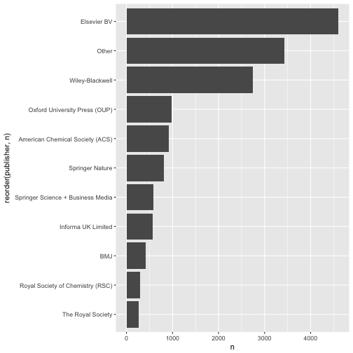

## What's published in hybrid journals?

### How to retrieve a list of hybrid journals?

To my knowledge, there's no comprehensive list of hybrid OA journals. However, a list of 
hybrid OA journals can be compiled using the Open APC dataset curated by the 
[Open APC Initiative](github.com/openapc/openapc-de) initiative. This initiative collects and shares
institutional spending information for open access publication fees, including those spent for publication
in hybrid journals. 

Let's retrieve the most current dataset:


```r
library(dplyr)
# link to dataset
u <- "https://raw.githubusercontent.com/OpenAPC/openapc-de/master/data/apc_de.csv"
o_apc <- readr::read_csv(u) %>%
  filter(is_hybrid == TRUE) 
```

Some summary statistics:

by publishers (top 10)


```r
library(ggplot2)
o_apc %>%
  mutate(publisher = forcats::fct_lump(publisher, n = 10)) %>%
  count(publisher, sort = TRUE) %>%
  ggplot(aes(reorder(publisher, n), n)) + 
  geom_bar(stat= "identity") +
  coord_flip()
```




## How does it relate to the general hybrid output per journal?

Crossref Metadata API is used to get both license information and number of articles 
published per year. The API is accessed via  
[rOpenSci's rcrossref client](https://github.com/ropensci/rcrossref).

Instead of fetching all articles published, we use facet counts. 

<https://github.com/CrossRef/rest-api-doc/#facet-counts>


```r
jn_facets <- rcrossref::cr_journals(
  "1053-8119",
  filter = c(from_pub_date = "2014-01-01", until_pub_date = "2014-12-31"),
  works = TRUE,
  limit = 0,
  facet=TRUE)

jn_facets$facets$license
#>                                                    .id   V1
#> 1         http://www.elsevier.com/tdm/userlicense/1.0/ 1065
#> 2          http://creativecommons.org/licenses/by/3.0/   65
#> 3    http://creativecommons.org/licenses/by-nc-nd/3.0/   56
#> 4    http://creativecommons.org/licenses/by-nc-sa/3.0/   13
#> 5    http://creativecommons.org/licenses/by-nc-nd/4.0/    6
#> 6          http://creativecommons.org/licenses/by/4.0/    3
#> 7 http://www.elsevier.com/open-access/userlicense/1.0/    2

jn_facets$facets$`type-name`
#>               .id   V1
#> 1 Journal Article 1078
```

There are two helpful facets, `license` for getting license infos and
`type-name` for the number of published articles facetted by type

In the first step, get a summary table of articles funded per journal and year


```r
hybrid_jn <- o_apc %>%
  group_by(journal_full_title, issn, period) %>%
  summarise(n = n()) %>%
  arrange(desc(n))
```


